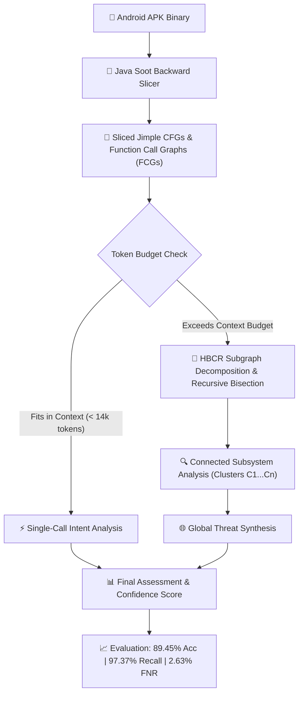

<div align="center">

# 🛡️ AndMAL_Detector
### Context-Driven Android Malware Detection via Hierarchical Graph-Connected LLM Reasoning

[](https://www.python.org/downloads/)
[](https://github.com/soot-oss/soot)
[](https://developer.nvidia.com/cuda-toolkit)
[](#benchmark-results)
[](#benchmark-results)
[](LICENSE)

*An end-to-end static analysis and Large Language Model (LLM) framework that identifies malicious Android applications through backward program slicing, hierarchical graph-connected code chunking (HBCR), and deep semantic intent reasoning.*

</div>

---

## 📌 Table of Contents
- [Key Highlights](#-key-highlights)
- [System Architecture](#-system-architecture)
- [Benchmark Results](#-benchmark-results)
- [Installation & Setup](#-installation--setup)
- [Quick Start Pipeline](#-quick-start-pipeline)
- [Advanced Features & Innovation](#-advanced-features--innovation)
- [Project Structure](#-project-structure)
- [License & Citation](#-license--citation)

---

## ✨ Key Highlights

- 🔬 **Backward-Sliced Static Analysis**: Decompiles Android APKs into Jimple Intermediate Representation (IR) and performs backward program slicing from sensitive API call sites (`sendTextMessage`, `DexClassLoader`, `getDeviceId`, `Cipher.doFinal`, `openConnection`, `exec`).
- 🧩 **HBCR (Hierarchical Graph-Connected Reasoning)**: Partitions large applications into caller-callee and resource-linked subgraphs to preserve data-flow context without function fragmentation or context budget overflow.
- ⚡ **Native Dual-GPU CUDA Execution**: Built-in 50/50 tensor splitting across dual NVIDIA GPUs (`llama-cpp-python` / Ollama) for zero-latency local execution of Qwen 2.5 32B models.
- 🎯 **Calibrated Intent Reasoning**: Distinguishes legitimate framework behavior (Android NDK `System.loadLibrary`, Google Play Services Dynamite module loading) from stealthy malware droppers (e.g. `dnotua` trojans obfuscated within fake Google SDK packages).
- 💬 **Interactive Malware Chatbot**: Web-based AI assistant for inspecting APK verdicts, querying function call chains, and conducting threat investigations.

---

## 🏗️ System Architecture



---

## 📊 Benchmark Results

Evaluated on an empirical benchmark of Android applications across multiple malware families (including `dnotua`, `fakeadblocker`, `rotexy`, `artemis`, `svpeng`, `phishingapp`, `metasploit`, `tencentprotect`) and benign apps:

### 📈 Overall Performance Metrics
| Metric | Value | Baseline Comparison |
| :--- | :---: | :---: |
| **Total Samples Evaluated** | **199** | — |
| **Accuracy** | **89.45%** | $\mathbf{+35.68\%}$ *(vs. 53.77% baseline)* |
| **Precision** | **64.91%** | $\mathbf{+42.34\%}$ *(vs. 22.57% baseline)* |
| **Recall (Sensitivity)** | **97.37%** | $\mathbf{+31.58\%}$ *(vs. 65.79% baseline)* |
| **F1 Score** | **77.89%** | $\mathbf{+44.24\%}$ *(vs. 33.65% baseline)* |
| **False Positive Rate (FPR)** | **12.42%** | Slashed from 48.45% $\rightarrow$ **12.42%** |
| **False Negative Rate (FNR)** | **2.63%** | Reduced from 34.21% $\rightarrow$ **2.63%** |

### 🎯 Confusion Matrix
| Ground Truth | Predicted BENIGN | Predicted MALWARE | Total |
| :--- | :---: | :---: | :---: |
| **Actual BENIGN** | **141** (True Negative) | **20** (False Positive) | 161 |
| **Actual MALWARE** | **1** (False Negative) | **37** (True Positive) | 38 |
| **Total** | 142 | 57 | 199 |

### 🔍 Per-Family Detection Rates
| Malware Family | Detected / Total | Detection Rate |
| :--- | :---: | :---: |
| **`dnotua` (Disguised Dropper)** | **23 / 23** | **100.0%** |
| **`fakeadblocker` (Ad Fraud / Stealth)** | **4 / 4** | **100.0%** |
| **`rotexy` (Banking Trojan / SMS)** | **4 / 4** | **100.0%** |
| **`artemis` (Trojan)** | **2 / 2** | **100.0%** |
| **`phishingapp` (Credential Stealer)** | **1 / 1** | **100.0%** |
| **`metasploit` (Reverse Shell Backdoor)** | **1 / 1** | **100.0%** |
| **`svpeng` (Screen Locker / Ransomware)** | **1 / 1** | **100.0%** |
| **`tencentprotect` (Obfuscated Wrapper)** | **1 / 1** | **100.0%** |

---

## ⚙️ Installation & Setup

### 1. Prerequisites
- **Python:** 3.10 or 3.11
- **Java:** JDK 11 or 17 (for Soot Slicer)
- **GPU (Optional):** NVIDIA GPU with CUDA 12+ for local 32B model inference

### 2. Clone and Setup Environment
```bash
git clone https://github.com/arpitsng/AndMAL_Detector.git
cd AndMAL_Detector

python -m venv venv
# Windows:
venv\Scripts\activate
# Linux/macOS:
source venv/bin/activate

pip install -r requirements.txt
```

### 3. Environment Configuration (`.env`)
Create a `.env` file in the root directory:
```ini
# AndroZoo API Key (for downloading APKs)
ANDROZOO_API_KEY=your_key_here

# Cloud LLM Backends (Optional)
GEMINI_API_KEY1=your_gemini_key_1
GEMINI_API_KEY2=your_gemini_key_2
GEMINI_API_KEY3=your_gemini_key_3
OPENAI_API_KEY=sk-...
GROQ_API_KEY=gsk-...

# Qdrant Cloud Vector Database (For RAG)
QDRANT_URL=https://your-cluster.qdrant.io
QDRANT_API_KEY=your_qdrant_key
```

---

## 🚀 Quick Start Pipeline

### Phase 1: Static Analysis & CFG Extraction
Decompile APKs, trace sensitive API call sites, and extract backward-sliced Control Flow Graphs (Jimple IR):
```bash
python src_python/2_extract_cfg.py --csv data/train.csv --limit 10
```

### Phase 2: LLM Inference (HBCR + Dual-GPU / Cloud)

#### Option A: Local Dual-GPU Qwen 2.5 32B (GGUF CUDA)
```bash
python src_python/4_llm_inference.py --mode cfg --backend gguf --single --csv data/test_1.csv --cfg-dir extracted_cfgs --output results/predictions.jsonl
```

#### Option B: Google Gemini 2.5 Flash (Cloud API)
```bash
python src_python/4_llm_inference.py --mode cfg --backend gemini --single --csv data/test_1.csv --cfg-dir extracted_cfgs --output results/predictions.jsonl
```

### Phase 3: Evaluate Performance
Score predictions against ground truth labels and generate confusion matrix metrics:
```bash
python src_python/5_evaluate.py --predictions results/predictions.jsonl
```

### Phase 4: Interactive Threat Analysis Chatbot
Launch the interactive web interface to query analysis reports and inspect APKs:
```bash
python src_python/9_chatbot_server.py
```
Open `http://localhost:8765` in your browser.

---

## 🧠 Advanced Features & Innovation

### 1. HBCR: Hierarchical Graph-Connected Reasoning
When an application contains dozens or hundreds of sliced functions, naive chunking truncates caller-callee chains. HBCR constructs a **connectivity graph** $G = (V, E)$ where:
- Nodes $V$ are sliced functions.
- Edges $E$ represent direct call-graph edges (`CALLS` / `CALLED_BY`) and virtual edges for shared resources (`Cipher.doFinal` keys, file paths, dynamic class targets).
- Connected components are analyzed independently, followed by global threat synthesis that evaluates cross-cluster boundary interactions.

### 2. Calibrated Intent Discrimination
- **False Positive Elimination**: Calibrated prompt constraints identify standard Android NDK execution (`System.loadLibrary` loading bundled `libunity.so` / `libc++_shared.so`) and genuine Google Play Services Dynamite module loading.
- **False Negative Suppression**: Targeted dropper heuristics detect `dnotua` malware that obfuscates dynamic class loading under spoofed `com.google.android.gms.internal` namespaces.

---

## 📁 Project Structure

```
AndMAL_Detector/
├── Slicer/                     # Java Soot backward-slicing tool (generates Jimple CFGs)
├── data/                       # Ground-truth datasets and sample metadata
├── results/
│   ├── eval_report.md          # Benchmark evaluation report (89.45% accuracy, 2.63% FNR)
│   └── predictions.jsonl       # Full JSONL prediction log with LLM reasoning
├── src_python/
│   ├── 1_download_apk.py       # Automated APK downloader from AndroZoo
│   ├── 2_extract_cfg.py        # Static slicing execution manager
│   ├── 3_build_dataset.py      # Dataset partitioner and metadata builder
│   ├── 4_llm_inference.py      # HBCR graph-connected LLM inference engine
│   ├── 5_evaluate.py           # Evaluation & confusion matrix metric generator
│   ├── 6_build_local_db.py     # Local vector embedding builder
│   ├── 6_build_qdrant_db.py    # Qdrant cloud RAG indexer
│   ├── 7_rag_only_inference.py # Vector semantic similarity evaluator
│   ├── 9_chatbot_server.py     # FastAPI interactive malware analysis web server
│   ├── chatbot_core.py         # Analysis backend for chatbot interface
│   ├── console_ui.py           # Rich terminal dashboard
│   └── prompts.py              # Calibrated system prompts, HBCR & DRC templates
├── static/                     # Web UI assets for analysis chatbot
├── COMMANDS.md                 # Full CLI command reference
├── requirements.txt            # Python dependencies
└── start_ollama_dual_gpu.bat   # Windows Dual-GPU Ollama service launcher
```

---

## 📜 License & Citation

This project is licensed under the MIT License - see the [LICENSE](LICENSE) file for details.

If you find this work helpful in your research, please cite:
```bibtex
@misc{andmal_detector_2026,
  title={AndMAL_Detector: Context-Driven Android Malware Detection via Hierarchical Graph-Connected LLM Reasoning},
  author={Arpit S. and Research Contributors},
  year={2026},
  publisher={GitHub},
  howpublished={\url{https://github.com/arpitsng/AndMAL_Detector}}
}
```
