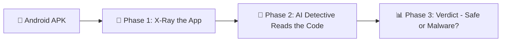
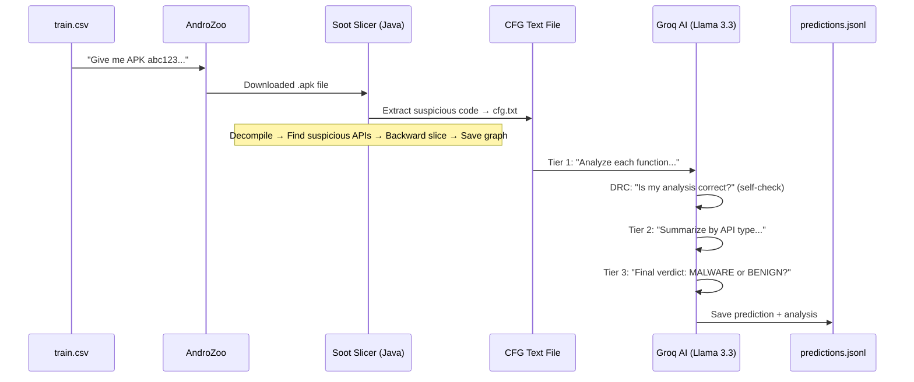

# AndMAL_Detector — End-to-End Explanation 🧠🔍

> **Goal:** We have Android apps (APK files). We want to figure out: *Is this app safe, or is it malware?*
> Instead of using traditional antivirus rules, we use an **AI (Large Language Model)** to read the app's code and make a judgment.

---

## The Big Picture (3 Phases)

Think of it like a detective investigating a suspect:



| Phase | What happens | Command |
|-------|-------------|---------|
| **Phase 1** | Download APK → Extract suspicious code patterns (CFGs) | `python src_python/2_extract_cfg.py --limit 5` |
| **Phase 2** | Send those code patterns to an AI (Groq/LLM) for analysis | `python src_python/4_llm_inference.py --mode cfg --backend groq --limit 5` |
| **Phase 3** | Compare AI's predictions against known answers → Score it | `python src_python/5_evaluate.py --predictions results/predictions_cfg.jsonl` |

---

## Phase 1: X-Ray the App 🔬

### Command
```bash
python src_python/2_extract_cfg.py --limit 5
```

### What happens step by step:

1. **Read the list of apps to test**
   - Opens [train.csv](file:///c:/Users/devan/Desktop/AndMAL_Detector/data/train.csv) which has a list of app fingerprints (SHA-256 hashes) and whether each app is `malware` or `benign`
   - With `--limit 5`, it picks only the first 5 apps

2. **Download each APK from AndroZoo**
   - [AndroZoo](https://androzoo.uni.lu/) is a giant online library of Android apps used for research
   - The script uses your `ANDROZOO_API_KEY` (from `.env`) to download each APK file
   - Think of it like: *"Hey library, give me app #0794123bce..."* → downloads the `.apk` file

3. **Run the Java "Slicer" tool on each APK**
   - This is the [BackwardSlicer.java](file:///c:/Users/devan/Desktop/AndMAL_Detector/Slicer/src/main/java/BackwardSlicer.java) program we compiled into `slicer-1.0.jar`
   - It uses a tool called **Soot** (a Java code analysis framework) to:
     - Decompile the APK (turn the compiled app back into readable code)
     - Find all **suspicious API calls** (like `getDeviceId()`, `sendTextMessage()`, `getLocation()`, etc.)
     - For each suspicious call, trace *backwards* through the code to understand what leads up to it
     - This produces a **Control Flow Graph (CFG)** — a map of "what code runs in what order"

4. **Save the CFG as a text file**
   - Output: `extracted_cfgs/<sha256>_cfg.txt`
   - Each file contains blocks like:
     ```
     === Function: com.example.app.SmsService.sendSms ===
     Suspicious API: android.telephony.SmsManager.sendTextMessage
     Nodes: [statements of code...]
     Edges: [which statement leads to which...]
     ```

5. **Delete the downloaded APK** (to save disk space)

> **Analogy:** Phase 1 is like an X-ray machine at airport security. You put the app through it, and it highlights all the "suspicious-looking" parts of the code.

---

## Phase 2: AI Detective Reads the Code 🧠

### Command
```bash
python src_python/4_llm_inference.py --mode cfg --backend groq --limit 5
```

### What the flags mean:
- `--mode cfg` → Use the CFG files we just extracted (not pre-computed logs)
- `--backend groq` → Use Groq's API (which runs Llama 3.3 70B, a powerful open-source AI model)
- `--limit 5` → Process only the first 5 samples

### The 3-Tier AI Analysis (like a court trial):

This is the core of the **LAMD framework** from the research paper. It doesn't just ask the AI once — it asks **three rounds of increasingly broad questions**:

#### 🔍 Tier 1: Function-Level Analysis (The Witness Interviews)

For **each suspicious function** found in the CFG:
- The AI reads the code slice and answers:
  - *"What does this function do?"*
  - *"Is this behavior normal or suspicious?"*
  - *"Risk level: LOW / MEDIUM / HIGH / CRITICAL?"*

- **DRC Check (Double-checking the witness):** After each answer, a *second* AI call verifies: *"Is the analysis factually consistent with the actual code?"* If the consistency score is below 95%, the AI re-does the analysis. This prevents hallucinations!

> Example: The AI might say: *"This function `sendSms()` sends an SMS to a hardcoded premium number without user consent. RISK: CRITICAL"*

#### 📊 Tier 2: API-Level Aggregation (The Expert Report)

Groups all Tier 1 results by **API type** (e.g., all SMS functions together, all network functions together):
- The AI reads all the function summaries for one API and answers:
  - *"Looking at ALL the places this app uses SMS, what's the overall pattern?"*
  - *"Is this consistent with legitimate use or malicious intent?"*

> Example: *"The app uses SMS in 3 functions. Two send messages to premium numbers without consent. One reads inbox contents. Overall pattern: MALICIOUS SMS abuse. RISK: CRITICAL"*

#### ⚖️ Tier 3: APK-Level Verdict (The Judge's Decision)

Takes ALL the Tier 2 API reports and makes a **final decision**:
- The AI reads the full picture and decides:
  - **MALWARE** or **BENIGN**
  - Plus a written explanation of why

> Example: *"Based on unauthorized SMS sending, covert data exfiltration via HTTP, and accessing device identifiers without consent — PREDICTION: MALWARE"*

### Output
- Saves results to [predictions_cfg.jsonl](file:///c:/Users/devan/Desktop/AndMAL_Detector/results/predictions_cfg.jsonl)
- Each line is a JSON object: `{"sha256": "...", "prediction": "MALWARE", "ground_truth": "BENIGN", "analysis": "..."}`

> **Analogy:** Phase 2 is like a courtroom trial. Tier 1 = interviewing witnesses. Tier 2 = expert testimony summarizing evidence. Tier 3 = the judge reading everything and delivering a verdict.

---

## Phase 3: Score the Results 📊

### Command
```bash
python src_python/5_evaluate.py --predictions results/predictions_cfg.jsonl
```

### What happens:
- Compares each AI prediction against the **known answer** (ground truth from `train.csv`)
- Calculates:
  - **Accuracy** — How many did it get right overall?
  - **Precision** — When it says "MALWARE", how often is it actually malware?
  - **Recall** — Of all real malware, how many did it catch?
  - **F1 Score** — A balanced score combining precision and recall
  - **Confusion Matrix** — A 2x2 table showing correct vs incorrect predictions

---

## The Complete Flow (One APK's Journey)



---

## File Map — Where Everything Lives

| File/Folder | Purpose |
|-------------|---------|
| `data/train.csv` | List of apps with labels (malware/benign) |
| `.env` | API keys (AndroZoo + Groq) |
| `Slicer/target/slicer-1.0.jar` | The compiled Java tool that X-rays APKs |
| `src_python/2_extract_cfg.py` | Phase 1 script (download + extract) |
| `src_python/4_llm_inference.py` | Phase 2 script (AI analysis) |
| `src_python/5_evaluate.py` | Phase 3 script (scoring) |
| `extracted_cfgs/` | Output of Phase 1 (CFG text files) |
| `results/predictions_cfg.jsonl` | Output of Phase 2 (AI predictions) |
| `results/eval_report.md` | Output of Phase 3 (accuracy report) |

---

## Why This Approach is Smart 💡

Traditional malware detectors use fixed rules like *"if the app sends SMS, flag it."* But that catches too many innocent apps!

Our approach (from the **LAMD** research paper) is smarter:
1. **Context-aware:** The AI doesn't just see *"app sends SMS"* — it sees the entire code path leading to that SMS call, and judges whether it looks like legitimate user-initiated behavior or sneaky background malware
2. **Self-checking (DRC):** The AI double-checks its own work to avoid making stuff up
3. **Multi-level reasoning:** Instead of one quick glance, the AI builds understanding from functions → APIs → whole app, like a detective building a case

> **TL;DR:** We download Android apps, X-ray their code to find suspicious parts, then ask an AI to read that code like a security expert and decide: **"Is this app trying to steal your data, or is it just a normal app?"**
