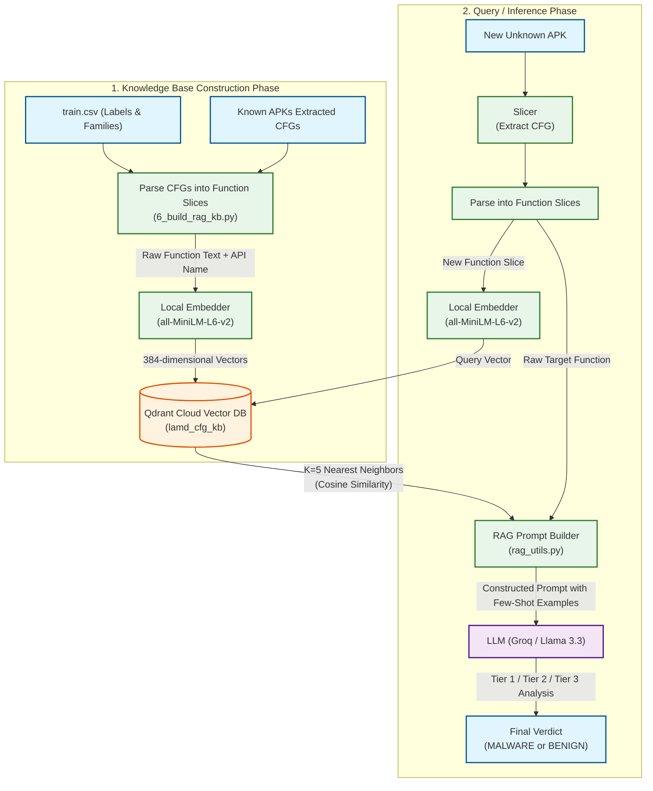

# LAMD RAG Architecture

This diagram illustrates how the K-Nearest Neighbors (KNN) logic fits into the overall Retrieval-Augmented Generation (RAG) architecture of your malware detection system.

### Key Components Explained:

*   **Function Slices**: The core unit of data. The CFG is not processed as one giant block; it's sliced into individual functions that contain suspicious APIs.
*   **Local Embedder**: The `sentence-transformers/all-MiniLM-L6-v2` model converts the text of a function slice into a 384-dimensional mathematical array (a vector).
*   **Qdrant Cloud (Vector DB)**: Stores the vectors of the known training dataset. 
*   **K=5 Nearest Neighbors**: During inference, Qdrant mathematically compares the new function's vector against all stored vectors to find the 5 most similar functions.
*   **RAG Prompt Builder**: Injects those 5 nearest historical examples (along with whether they were malware or benign) into the LLM's prompt as context before asking it to analyze the new function.
