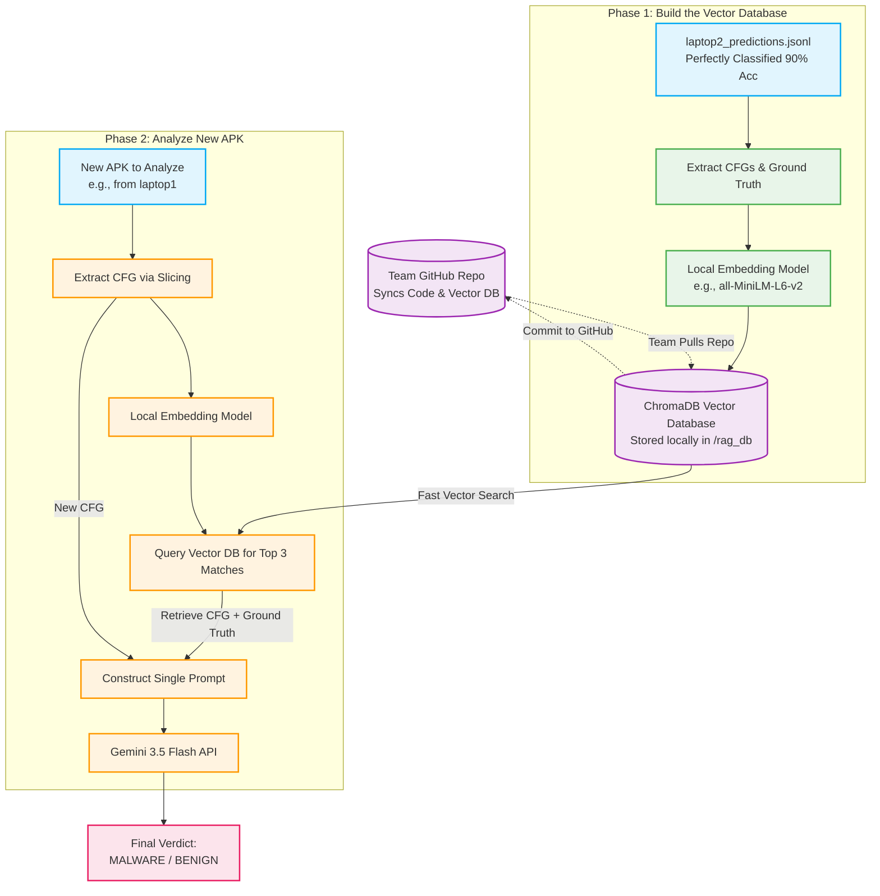

# RAG-Augmented Single-Call Architecture Flowchart

This document illustrates how the proposed Dynamic RAG pipeline works, allowing the system to achieve high accuracy (by dynamically fetching similar past examples) while remaining extremely fast and API-efficient (only 1 API call per APK).

## How the Team Collaborates (Multi-Implementation)

1. **The Vector Database (`/rag_db`) is just a folder.** 
   When we use a tool like ChromaDB, the entire database is saved locally as files in a folder (e.g., `AndMAL_Detector/rag_db/`).
2. **Syncing via GitHub:** 
   Because the database is lightweight (just text embeddings), you simply commit the `rag_db` folder to GitHub. 
3. **Working on different laptops:**
   When your friends run `git pull`, they will download the exact same Vector Database to their laptops. When they run the script, their local script queries their local copy of the database. 
4. **No Cloud Bottlenecks:** 
   Because the embedding and querying happen locally on each laptop's CPU in milliseconds, there is zero cloud latency. The only cloud component is the final API call to Gemini.
