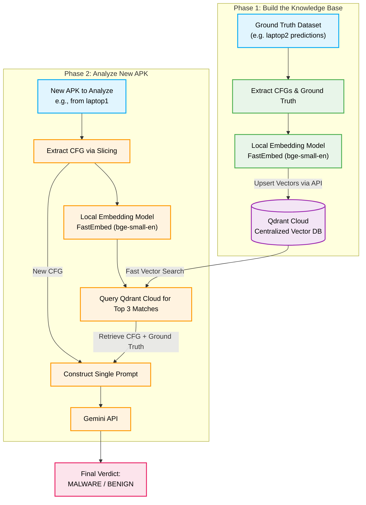

# RAG-Augmented Single-Call Architecture Flowchart

This document illustrates how the proposed Dynamic RAG pipeline works, allowing the system to achieve high accuracy (by dynamically fetching similar past examples) while remaining extremely fast and API-efficient (only 1 API call per APK).

## How the Team Collaborates (Cloud Architecture)

1. **Centralized Vector Database (Qdrant Cloud):** 
   Instead of storing the database locally and relying on Git pulls (which causes merge conflicts when multiple people process APKs simultaneously), all vectors are stored securely in a free Qdrant Cloud cluster.
2. **Local FastEmbed:** 
   The heavy lifting of converting code to vectors is done locally on each team member's laptop using `fastembed`. This prevents you from paying for OpenAI embeddings or overloading your Gemini API keys.
3. **No Git Merge Conflicts:**
   As you and your friends process new APKs, you can all write directly to Qdrant Cloud via the API. There is no need to commit database files to GitHub.
4. **Future-Proof for Chatbot UI:** 
   When you eventually build your AI UI Chatbot, it can instantly connect to the Qdrant Cloud cluster via API to fetch knowledge, meaning the backend is entirely ready for scale.
